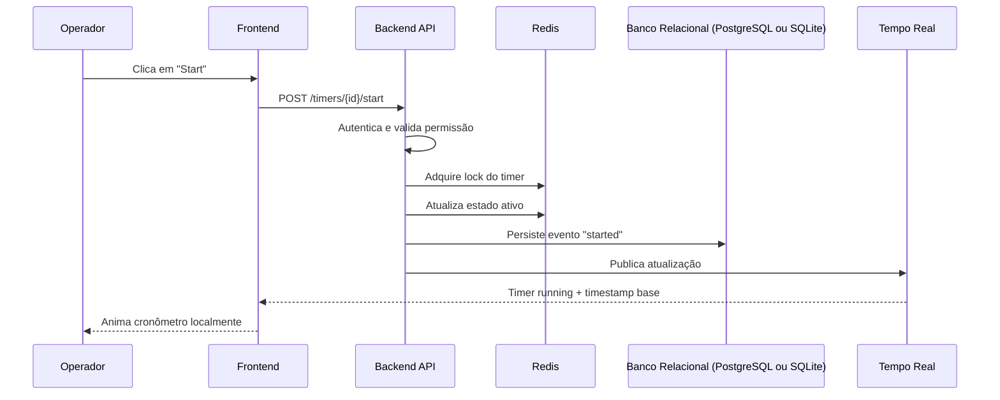
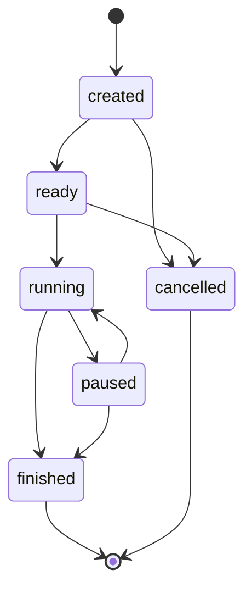

# Arquitetura do Projeto Tempus

## 1. Visão Geral

O **Tempus** é um sistema web para gerenciamento de cronômetros online voltado a competições esportivas, como **Hyrox**, **CrossFit** e modalidades similares.
Seu objetivo é permitir o controle confiável, rápido e auditável de múltiplos cronômetros, com atualização em tempo real para operadores, telões, dashboards e outros consumidores.

A arquitetura do Tempus deve priorizar:

* baixa latência
* alta confiabilidade operacional
* consistência dos resultados oficiais
* boa experiência de uso durante a competição
* rastreabilidade completa das ações
* capacidade de escalar múltiplos cronômetros simultâneos

---

## 2. Objetivos Arquiteturais

Os principais objetivos da arquitetura são:

1. Permitir a execução de cronômetros em tempo real sem degradação da experiência do usuário.
2. Separar o **estado quente** do cronômetro em execução do **estado persistente oficial**.
3. Garantir que os resultados finais sejam auditáveis e reconstruíveis.
4. Reduzir escrita desnecessária em banco relacional durante a execução.
5. Permitir atualização em tempo real para múltiplos clientes conectados.
6. Assegurar segurança, integridade e controle de acesso.
7. Possibilitar futura evolução para múltiplos tipos de competição e integrações externas.

---

## 3. Princípios Arquiteturais

### 3.1. Backend como autoridade do tempo

O backend é a fonte oficial da verdade para o estado do cronômetro.
O frontend não deve decidir o tempo oficial, apenas exibir e animar visualmente o estado recebido.

### 3.2. Estado quente fora do banco relacional

O estado ativo dos cronômetros em execução deve ficar em uma camada de baixa latência, como **Redis**, e não no banco relacional.

### 3.3. Persistência por eventos

O sistema deve persistir os **eventos relevantes do cronômetro**, e não o incremento contínuo de tempo.

Exemplos de eventos:

* timer criado
* timer iniciado
* timer pausado
* timer retomado
* parcial registrada
* timer finalizado
* ajuste manual aplicado
* resultado homologado

### 3.4. Renderização fluida no cliente

O frontend deve ser capaz de animar localmente o contador com base em um timestamp e em dados de sincronização recebidos do backend, evitando tráfego excessivo.

### 3.5. Auditabilidade por padrão

Toda ação operacional relevante deve gerar trilha de auditoria.

---

## 4. Requisitos Funcionais

## 4.1. Gestão de competições

* O sistema deve permitir cadastrar competições.
* O sistema deve permitir cadastrar categorias, provas, heats, baterias ou rounds.
* O sistema deve permitir cadastrar atletas, equipes ou participantes.
* O sistema deve permitir associar participantes a provas e baterias.

## 4.2. Gestão de cronômetros

* O sistema deve permitir criar cronômetros vinculados a uma competição, bateria, atleta, equipe ou raia.
* O sistema deve permitir iniciar um cronômetro.
* O sistema deve permitir pausar um cronômetro.
* O sistema deve permitir retomar um cronômetro pausado.
* O sistema deve permitir finalizar um cronômetro.
* O sistema deve permitir cancelar um cronômetro quando aplicável.
* O sistema deve permitir ajustar manualmente um cronômetro mediante permissão adequada.
* O sistema deve permitir registrar parciais ou splits.
* O sistema deve permitir operar múltiplos cronômetros simultaneamente.

## 4.3. Atualização em tempo real

* O sistema deve atualizar em tempo real o estado dos cronômetros para operadores conectados.
* O sistema deve atualizar em tempo real telões, dashboards e painéis públicos, quando habilitados.
* O sistema deve permitir sincronização rápida de clientes recém-conectados.

## 4.4. Visualização e resultados

* O sistema deve exibir o tempo corrente de cronômetros em execução.
* O sistema deve exibir o status do cronômetro, como `created`, `running`, `paused`, `finished`, `cancelled`.
* O sistema deve exibir resultados finais oficiais.
* O sistema deve permitir consulta de histórico e eventos de cada cronômetro.
* O sistema deve permitir exportar resultados e relatórios.

## 4.5. Auditoria e operação

* O sistema deve registrar quem executou cada ação.
* O sistema deve registrar data e hora de cada mudança de estado.
* O sistema deve registrar justificativas para ajustes manuais, quando exigido.
* O sistema deve permitir reprocessar ou reconstruir o estado de um cronômetro a partir de seus eventos.

## 4.6. Controle de acesso

* O sistema deve possuir autenticação de usuários.
* O sistema deve possuir perfis de acesso, como operador, juiz, administrador e competidor.
* O sistema deve restringir operações sensíveis conforme o perfil do usuário.

---

## 5. Requisitos Não Funcionais

## 5.1. Desempenho

* O sistema deve apresentar baixa latência para operações de controle de cronômetro.
* O sistema deve suportar múltiplos cronômetros ativos simultaneamente sem degradação perceptível.
* O sistema deve evitar escrita contínua no banco relacional para cada incremento de tempo.

## 5.2. Escalabilidade

* O backend deve poder ser executado em múltiplas instâncias.
* O estado ativo deve estar desacoplado da memória local do processo.
* O mecanismo de atualização em tempo real deve suportar múltiplos clientes concorrentes.

## 5.3. Disponibilidade

* O sistema deve ser resiliente a falhas transitórias.
* O sistema deve conseguir restaurar o estado dos cronômetros ativos após reinício controlado ou falha parcial.
* O sistema deve minimizar pontos únicos de falha.

## 5.4. Consistência

* O resultado oficial deve ser consistente e auditável.
* O sistema deve impedir transições de estado inválidas.
* O sistema deve evitar duplicidade de comandos, como duplo start ou múltiplos finishes.

## 5.5. Segurança

* O sistema deve proteger dados em trânsito e em repouso.
* O sistema deve registrar ações críticas.
* O sistema deve aplicar segregação de permissões.
* O sistema deve possuir controles contra abuso e alteração indevida de resultados.

## 5.6. Observabilidade

* O sistema deve possuir logs estruturados.
* O sistema deve expor métricas de saúde e desempenho.
* O sistema deve permitir rastreamento de erros, comandos e eventos.

## 5.7. Manutenibilidade

* A arquitetura deve favorecer separação de responsabilidades.
* O sistema deve permitir evolução incremental.
* O código deve ser organizado por domínio e não apenas por camada técnica.

---

## 6. Regras de Segurança

## 6.1. Autenticação e sessão

* Todo usuário operador deve autenticar-se antes de operar o sistema.
* Sessões devem possuir expiração.
* Tokens de autenticação devem ser protegidos contra vazamento.
* Deve ser suportado revogação de sessão em caso de incidente.

## 6.2. Autorização

* O princípio do menor privilégio deve ser aplicado.
* Perfis distintos devem possuir permissões distintas.
* Ações críticas devem ser restritas a perfis autorizados.
* Ajustes manuais e homologação de resultado devem exigir autorização específica.

## 6.3. Proteção de comunicação

* Todo tráfego entre cliente e servidor deve usar TLS.
* Comunicação interna entre componentes também deve ser protegida sempre que possível.
* WebSocket deve operar sobre canal seguro.

## 6.4. Integridade operacional

* Toda mudança de estado do cronômetro deve ser validada por máquina de estados.
* Comandos devem possuir proteção contra repetição indevida.
* Deve existir controle de concorrência para evitar race conditions.
* Eventos devem possuir identificador único e ordenação confiável.

## 6.5. Auditoria

* Toda operação crítica deve ser auditada.
* Logs de auditoria devem registrar:

  * usuário
  * ação
  * timestamp
  * origem
  * identificador do cronômetro
  * valores antes e depois, quando aplicável
* Logs de auditoria não devem ser facilmente alteráveis por operadores comuns.

## 6.6. Proteção de segredos

* Senhas, chaves e tokens não devem ficar hardcoded no código.
* Credenciais devem ser armazenadas em mecanismo seguro de secrets.
* Rotação de segredos deve ser suportada.

## 6.7. Validação de entrada

* Todas as entradas do usuário devem ser validadas no backend.
* Deve haver proteção contra injeções, payloads inválidos e manipulação indevida de parâmetros.
* Dados recebidos por APIs e WebSocket devem passar por validação de schema.

## 6.8. Disponibilidade e abuso

* Deve existir rate limit para endpoints administrativos e autenticação.
* Deve existir proteção contra flood de comandos.
* O sistema deve possuir timeout e circuit breaker onde fizer sentido.

## 6.9. Persistência e backup

* Banco relacional deve possuir política de backup.
* Logs de auditoria devem possuir retenção definida.
* Resultados finais devem ser protegidos contra exclusão acidental.

---

## 7. Abordagem de Armazenamento

## 7.1. Banco Relacional (PostgreSQL ou SQLite)

O Banco Relacional (PostgreSQL ou SQLite) será responsável por armazenar os dados permanentes e oficiais do sistema, como:

* competições
* categorias
* baterias
* participantes
* usuários
* perfis e permissões
* configuração de cronômetros
* eventos oficiais do cronômetro
* resultados finais
* auditoria

### Motivo

O banco relacional é excelente para:

* consistência transacional
* consultas analíticas
* integridade referencial
* rastreabilidade
* geração de relatórios

### O que não deve fazer

O Banco Relacional (PostgreSQL ou SQLite) não deve ser usado para armazenar o “tic” contínuo do cronômetro em execução com alta frequência.

---

## 7.2. Redis

O Redis será responsável por armazenar o estado ativo dos cronômetros em execução.

Exemplos de dados:

* estado atual do cronômetro
* versão do estado
* timestamp de início
* tempo acumulado antes de pausas
* locks curtos de operação
* estruturas auxiliares para timers ativos por evento ou bateria
* publicação de eventos em tempo real

### Motivo

O Redis é adequado para:

* baixa latência
* operações rápidas de leitura e escrita
* coordenação distribuída
* expiração de chaves
* mecanismos de pub/sub ou streams

---

## 8. Estratégia de Cronometragem

## 8.1. Não persistir o avanço contínuo do tempo

O sistema não deve persistir o valor do cronômetro a cada segundo ou milissegundo.

Em vez disso, deve persistir:

* instante de início
* instante de pausa
* instante de retomada
* instante de finalização
* tempo acumulado
* eventos intermediários relevantes

## 8.2. Cálculo do tempo corrente

O tempo atual exibido deve ser calculado a partir de:

* horário/base monotônica do backend
* tempo acumulado anterior
* instante da última retomada
* tempo total pausado

## 8.3. Renderização no frontend

O frontend deve:

1. receber o estado do timer
2. receber um timestamp de referência
3. calcular visualmente o avanço local
4. sincronizar novamente periodicamente ou em toda mudança de estado

---

## 9. Componentes da Arquitetura

## 9.1. Frontend Web

Responsável por:

* interface de operação
* dashboards
* telões
* exibição em tempo real
* autenticação do usuário
* renderização fluida dos cronômetros

### Responsabilidades

* enviar comandos ao backend
* exibir estados recebidos
* animar o cronômetro localmente
* lidar com reconexão de WebSocket
* nunca definir o tempo oficial

---

## 9.2. API Backend

Responsável por:

* autenticação e autorização
* validação de comandos
* regra de negócio
* transição de estados
* persistência de eventos
* publicação de atualizações em tempo real

### Responsabilidades

* validar comando recebido
* garantir idempotência
* atualizar estado no Redis
* persistir evento oficial no Banco Relacional (PostgreSQL ou SQLite)
* emitir atualização para clientes conectados

---

## 9.3. Redis

Responsável por:

* estado em memória dos timers ativos
* controle de concorrência distribuído
* pub/sub ou streams internos
* sincronização rápida entre instâncias

---

## 9.4. Banco Relacional (PostgreSQL ou SQLite)

Responsável por:

* armazenamento durável
* histórico oficial
* resultados finais
* auditoria
* relatórios e consultas operacionais

---

## 9.5. Serviço de Tempo Real

Pode estar embutido no backend ou separado, sendo responsável por:

* conexões WebSocket
* broadcast seletivo
* atualização de dashboards e telões
* redistribuição de eventos de timer

---

## 9.6. Observabilidade

Camada responsável por:

* logs estruturados
* métricas
* tracing
* alertas
* dashboards operacionais

---

## 10. Fluxos Principais

## 10.1. Fluxo de início do cronômetro

1. Operador aciona “iniciar”.
2. Frontend envia comando ao backend.
3. Backend autentica e valida permissão.
4. Backend verifica estado atual do timer.
5. Backend adquire lock curto no Redis.
6. Backend valida transição de estado.
7. Backend grava estado ativo no Redis.
8. Backend persiste evento `started` no Banco Relacional (PostgreSQL ou SQLite).
9. Backend publica evento em canal de tempo real.
10. Clientes atualizam a interface.

## 10.2. Fluxo de pausa

1. Operador aciona “pausar”.
2. Backend calcula tempo acumulado.
3. Backend atualiza estado no Redis.
4. Backend persiste evento `paused`.
5. Backend publica atualização.

## 10.3. Fluxo de retomada

1. Operador aciona “retomar”.
2. Backend valida permissão e estado.
3. Backend registra novo marco temporal.
4. Backend persiste evento `resumed`.
5. Backend publica atualização.

## 10.4. Fluxo de finalização

1. Operador aciona “finalizar”.
2. Backend calcula tempo final oficial.
3. Backend atualiza estado em Redis.
4. Backend persiste evento `finished`.
5. Backend grava resultado oficial.
6. Backend publica atualização final.

---

## 11. Máquina de Estados do Timer

Estados sugeridos:

* `created`
* `ready`
* `running`
* `paused`
* `finished`
* `cancelled`

Transições válidas sugeridas:

* `created -> ready`
* `ready -> running`
* `running -> paused`
* `paused -> running`
* `running -> finished`
* `paused -> finished`
* `created -> cancelled`
* `ready -> cancelled`

Transições inválidas devem ser rejeitadas, auditadas quando necessário e nunca aplicadas silenciosamente.

---

## 12. Modelo Conceitual de Dados

## 12.1. Entidades principais

* Competition
* Category
* Heat
* Lane
* Participant
* Team
* Timer
* TimerEvent
* OfficialResult
* User
* Role
* AuditLog

## 12.2. Exemplo de tabela `timers`

Campos sugeridos:

* `id`
* `competition_id`
* `heat_id`
* `lane_id`
* `participant_id` ou `team_id`
* `status`
* `created_at`
* `updated_at`

## 12.3. Exemplo de tabela `timer_events`

Campos sugeridos:

* `id`
* `timer_id`
* `event_type`
* `event_at`
* `accumulated_ms`
* `payload_json`
* `performed_by_user_id`
* `created_at`

## 12.4. Exemplo de tabela `official_results`

Campos sugeridos:

* `id`
* `timer_id`
* `final_time_ms`
* `status`
* `approved_by_user_id`
* `approved_at`
* `created_at`

## 12.5. Exemplo de tabela `audit_logs`

Campos sugeridos:

* `id`
* `actor_user_id`
* `action`
* `resource_type`
* `resource_id`
* `before_json`
* `after_json`
* `source_ip`
* `created_at`

---

## 13. Modelo de Estado no Redis

Exemplo conceitual de chave:

```text
tempus:timer:{timer_id}
```

Exemplo de estrutura:

```json
{
  "timer_id": "t_001",
  "status": "running",
  "version": 12,
  "started_at_utc": "2026-03-11T14:00:00Z",
  "last_resumed_at_utc": "2026-03-11T14:05:00Z",
  "accumulated_ms": 125000,
  "updated_at_utc": "2026-03-11T14:07:10Z"
}
```

Outras chaves úteis:

```text
tempus:event:{event_id}:active_timers
tempus:heat:{heat_id}:timers
tempus:lock:timer:{timer_id}
tempus:ws:channel:competition:{competition_id}
```

---

## 14. Estratégia de Concorrência e Idempotência

Para evitar inconsistências:

* usar lock curto por timer no Redis
* manter `version` do estado
* validar estado atual antes de qualquer transição
* tratar comandos duplicados como idempotentes quando possível
* rejeitar operações fora de ordem

Exemplo:

* um segundo comando `start` para timer já iniciado deve ser rejeitado ou tratado como noop controlado
* dois operadores tentando pausar simultaneamente devem resultar em apenas uma operação efetiva

---

## 15. Observabilidade

## 15.1. Logs

Os logs devem ser estruturados em JSON ou formato equivalente e incluir:

* timestamp
* nível
* request_id
* user_id
* timer_id
* command
* resultado
* erro, quando houver

## 15.2. Métricas

Métricas recomendadas:

* número de timers ativos
* comandos por segundo
* latência de start/pause/resume/finish
* conexões WebSocket ativas
* falhas de autenticação
* rejeições por transição inválida
* tempo de resposta do Redis
* tempo de resposta do Banco Relacional (PostgreSQL ou SQLite)

## 15.3. Alertas

Alertas recomendados:

* indisponibilidade do Redis
* indisponibilidade do Banco Relacional (PostgreSQL ou SQLite)
* falha de broadcast em tempo real
* crescimento anormal de erros
* alta latência de comandos
* divergência entre estado em Redis e persistência oficial

---

## 16. Estratégia de Resiliência

* Redis deve ser tratado como camada de estado operacional rápido.
* Banco Relacional (PostgreSQL ou SQLite) deve ser tratado como base oficial e durável.
* Em caso de reinício do backend, o sistema deve ser capaz de:

  * recarregar estado ativo do Redis
  * ou reconstruir estado a partir dos eventos persistidos
* Comandos devem ser transacionais no nível lógico.
* O sistema deve considerar recuperação pós-falha como requisito de primeira classe.

---

## 17. Decisão Arquitetural Principal

### Decisão

**Não utilizar o banco relacional como armazenamento principal do cronômetro em execução.**

### Justificativa

O cronômetro em execução exige:

* baixa latência
* altíssima frequência de leitura
* atualização imediata
* pouca tolerância à lentidão percebida

O banco relacional é mais adequado para:

* persistência oficial
* consistência durável
* relatórios
* auditoria
* consultas históricas

### Solução adotada

* **Redis** para estado ativo
* **Banco Relacional (PostgreSQL ou SQLite)** para histórico oficial
* **WebSocket** para propagação em tempo real
* **Frontend** com animação local controlada

---

## 18. Diagrama de Arquitetura Geral

```mermaid
flowchart LR
    A[Operador / Juiz / Admin] --> B[Frontend Web]
    P[Painel Público / Telão] --> B

    B -->|HTTPS / REST| C[API Backend]
    B -->|WSS| D[Canal de Tempo Real]

    C --> E[(Redis)]
    C --> F[(Banco Relacional (PostgreSQL ou SQLite))]

    D --> E
    D --> B
    D --> P

    C --> G[Logs / Métricas / Tracing]

    E -->|estado ativo, locks, pubsub| D
    F -->|eventos oficiais, resultados, auditoria| C
```

---

## 19. Diagrama do Fluxo de Controle do Timer



---

## 20. Diagrama de Máquina de Estados



---

## 21. Diretrizes de Implementação

## 21.1. Backend

Sugestões de responsabilidade do backend:

* módulo de autenticação
* módulo de autorização
* módulo de competição
* módulo de timers
* módulo de resultados
* módulo de auditoria
* módulo de tempo real

## 21.2. Frontend

Sugestões de comportamento:

* mostrar conectividade do WebSocket
* indicar sincronização do cronômetro
* travar botões conforme estado atual
* exibir feedback de erro operacional
* suportar reconexão automática

## 21.3. Banco relacional

Boas práticas:

* usar migrations
* chaves estrangeiras bem definidas
* índices em `timer_id`, `competition_id`, `heat_id`, `event_at`
* retenção adequada de auditoria

## 21.4. Redis

Boas práticas:

* prefixar chaves por domínio
* configurar expiração quando aplicável
* usar estrutura simples para leitura rápida
* separar canais/eventos por competição ou heat

---

## 22. Riscos Técnicos e Mitigações

### Risco: dupla operação por clique repetido

**Mitigação:** lock no Redis, versionamento e idempotência.

### Risco: diferença entre tempo exibido e tempo oficial

**Mitigação:** frontend apenas anima; backend permanece como autoridade.

### Risco: perda de estado ativo após falha

**Mitigação:** persistir eventos oficiais e prever reconstrução.

### Risco: lentidão em competição com muitos clientes

**Mitigação:** WebSocket, Redis e redução de polling.

### Risco: alteração indevida de resultado

**Mitigação:** RBAC, auditoria, trilha imutável e homologação.

---

## 23. Stack Sugerida

Exemplo de stack coerente com essa arquitetura:

* **Frontend:** React, Vue ou similar
* **Backend API:** Python com FastAPI ou Django + ASGI
* **Tempo real:** WebSocket
* **Banco relacional:** Banco Relacional (PostgreSQL ou SQLite)
* **Estado em memória / coordenação:** Redis
* **Observabilidade:** logs estruturados + métricas + tracing
* **Deploy:** containers e orquestração conforme necessidade

---

## 24. Conclusão

A arquitetura recomendada para o Tempus deve tratar o cronômetro em execução como um **estado operacional de baixa latência**, e não como uma sequência de atualizações contínuas em banco relacional.

A solução ideal é:

* **Redis** para estado ativo e coordenação
* **Banco Relacional (PostgreSQL ou SQLite)** para histórico oficial e auditoria
* **WebSocket** para atualização em tempo real
* **Frontend** com renderização local suave
* **Backend** como autoridade do tempo e das transições

Essa abordagem reduz carga desnecessária, melhora a usabilidade durante a competição e garante confiabilidade para os resultados oficiais.

---

Se quiser, no próximo passo eu posso transformar isso em um **README arquitetural profissional**, com estrutura de documento técnico, sumário, ADRs iniciais e uma proposta de **MVP do Tempus**.
