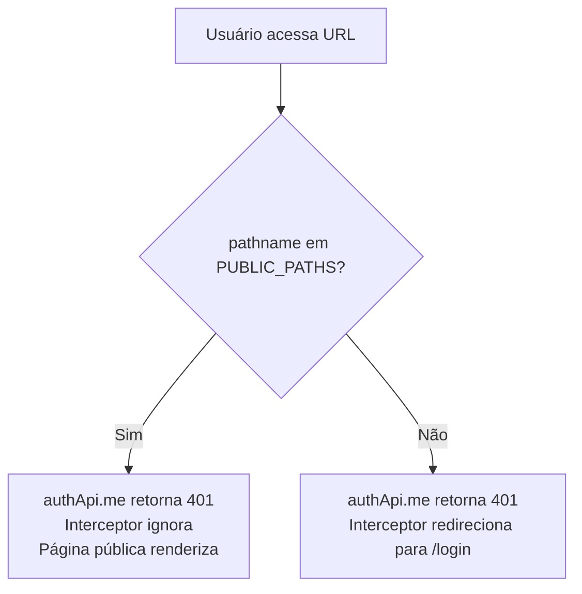

# ADR-001 — Correção: Redirecionamento indevido em páginas públicas (reset-password)

**Data:** 2026-03-10
**Status:** Aceito
**Contexto:** Bug reportado em produção — link de recuperação de senha redirecionava para `/login` ao invés de exibir o formulário de nova senha.

---

## Contexto

O sistema utiliza autenticação via sessão server-side com cookie `HttpOnly`. Na inicialização da SPA React, o `App.tsx` chama `authApi.me()` para verificar se o usuário já está autenticado. Essa chamada retorna `401 Unauthorized` quando não há sessão ativa — comportamento esperado para usuários não autenticados.

O interceptor Axios em `api/client.ts` redirecionava **qualquer** resposta `401` para `/login`, incluindo a chamada de inicialização feita durante o carregamento de páginas públicas como `/reset-password`.

### Fluxo problemático

```
Usuário clica no link de e-mail
  → Navegador abre /reset-password?token=...
  → App.tsx monta e chama authApi.me()
  → Backend retorna 401 (sem sessão ativa)
  → Interceptor Axios captura o 401
  → window.location.href = "/login"  ← redirecionamento indevido
```

## Decisão

Adicionar uma lista de caminhos públicos (`PUBLIC_PATHS`) ao interceptor. Quando a URL atual começa com um desses caminhos, o `401` não aciona o redirecionamento.

```typescript
// frontend/src/api/client.ts
const PUBLIC_PATHS = ["/login", "/reset-password", "/forgot-password", "/register"];

apiClient.interceptors.response.use(
  (response) => response,
  (error) => {
    const isPublicPath = PUBLIC_PATHS.some((p) =>
      window.location.pathname.startsWith(p)
    );
    if (error.response?.status === 401 && !isPublicPath) {
      window.location.href = "/login";
    }
    return Promise.reject(error);
  }
);
```

## Alternativas Consideradas

| Alternativa | Motivo da rejeição |
|-------------|-------------------|
| Verificar se a rota requer autenticação via React Router | Requereria expor lógica de rotas para fora do Router, acoplando a camada de API ao sistema de rotas |
| Não chamar `authApi.me()` em páginas públicas | Precisaria de lógica condicional em `App.tsx` dependente do path — duplicação de `PUBLIC_PATHS` |
| Usar flag na requisição (e.g., header `X-Public: true`) | Mais complexo sem ganho adicional de segurança ou clareza |

## Consequências

- **Positivo:** Páginas públicas (`/reset-password`, `/forgot-password`, `/register`) carregam corretamente mesmo sem sessão ativa.
- **Positivo:** Sessões expiradas em páginas protegidas ainda redirecionam para `/login`.
- **Atenção:** Novas rotas públicas precisam ser adicionadas a `PUBLIC_PATHS`. Falta de manutenção dessa lista causaria o mesmo bug.

## Diagrama


