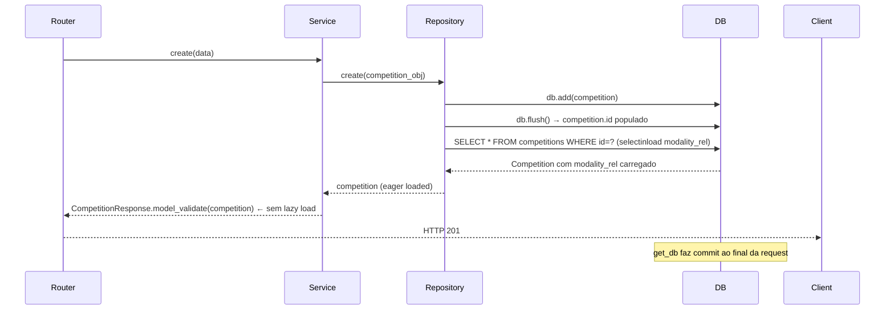

# ADR-002 — Correção: ROLLBACK ao criar competição com modality_id (MissingGreenlet)

**Data:** 2026-03-10
**Status:** Aceito
**Contexto:** Bug crítico — criar uma competição com `modality_id` retornava HTTP 500 com ROLLBACK no log do banco.

---

## Contexto

Ao criar ou atualizar uma competição vinculada a uma modalidade, o backend lançava:

```
sqlalchemy.exc.MissingGreenlet: greenlet_spawn has not been called;
can't call await_only() here. Was IO attempted in an unexpected place?
```

O erro ocorria em `CompetitionResponse.model_validate(competition, from_attributes=True)` quando o Pydantic tentava acessar `competition.modality_rel` para serializar o campo `modality_name`.

### Causa raiz

O método `CompetitionRepository.create()` usava `db.refresh(competition)` após o `flush()`. O `refresh` recarrega apenas as **colunas escalares** da tabela principal — **não carrega relacionamentos ORM** como `modality_rel`.

Quando o schema Pydantic acessava `competition.modality_rel.name`, o SQLAlchemy tentava fazer **lazy loading** do relacionamento. Em sessões assíncronas (`AsyncSession`), lazy loading não é permitido — lança `MissingGreenlet`, que interrompe a transação e causa ROLLBACK.

### Fluxo problemático

```
POST /competitions (com modality_id=1)
  → CompetitionService.create()
  → CompetitionRepository.create()
      → db.add(competition)
      → db.flush()          ← competition.id = 1
      → db.refresh(competition)  ← recarrega colunas; modality_rel = lazy proxy
  → CompetitionResponse.model_validate(competition, from_attributes=True)
      → acessa competition.modality_rel  ← LAZY LOAD!
      → MissingGreenlet exception
      → ROLLBACK automático
      → HTTP 500
```

## Decisão

Substituir `db.refresh()` por `get_by_id()` em todos os métodos de escrita do `CompetitionRepository`. O `get_by_id()` usa `selectinload(Competition.modality_rel)` com `.execution_options(populate_existing=True)`, garantindo que o relacionamento seja carregado de forma eager dentro da mesma transação.

```python
# backend/app/repositories/competition.py

@staticmethod
async def get_by_id(db: AsyncSession, competition_id: int) -> Competition | None:
    result = await db.execute(
        select(Competition)
        .options(selectinload(Competition.modality_rel))
        .where(Competition.id == competition_id)
        .execution_options(populate_existing=True)  # força reload do identity map
    )
    return result.scalar_one_or_none()

@staticmethod
async def create(db: AsyncSession, competition: Competition) -> Competition:
    db.add(competition)
    await db.flush()
    return await CompetitionRepository.get_by_id(db, competition.id)  # eager load

@staticmethod
async def update(db: AsyncSession, competition: Competition) -> Competition:
    await db.flush()
    return await CompetitionRepository.get_by_id(db, competition.id)  # eager load
```

### Por que `populate_existing=True`?

Sem essa opção, quando um objeto já existe no **identity map** da sessão SQLAlchemy (ex: objeto criado via `db.add(competition)`), uma consulta subsequente ao mesmo ID retorna o objeto em cache — sem executar os `selectinload`. O `populate_existing=True` força o SQLAlchemy a atualizar o objeto no identity map com os dados da nova query, incluindo os relacionamentos eager-loaded.

## Alternativas Consideradas

| Alternativa | Motivo da rejeição |
|-------------|-------------------|
| `db.refresh(competition, attribute_names=["modality_rel"])` | O `refresh` não suporta carregamento eager de relacionamentos via `selectinload`; usaria lazy load internamente |
| Usar `lazy="raise"` nos relacionamentos e sempre eager-load na query inicial | Boa prática mas não resolve o problema de `create()` que adiciona o objeto antes da query |
| Tornar `modality_name` um campo computado no service (sem tocar o ORM) | Contorna o problema mas adiciona lógica de transformação fora do schema, dificultando manutenção |

## Consequências

- **Positivo:** Criação e atualização de competições com modalidade funcionam corretamente.
- **Positivo:** Padrão `get_by_id()` após `flush()` é consistente com `HeatRepository` e `TeamRepository` já existentes.
- **Atenção:** Toda operação de escrita emite **duas queries** ao banco: um `INSERT/UPDATE` (via `flush`) e um `SELECT` (via `get_by_id`). Para o volume alvo (≤ 300 atletas), o impacto é desprezível.
- **Padrão aplicável:** Qualquer repository que retorna objeto com relacionamentos deve seguir este padrão `flush() → get_by_id()`.

## Diagrama


