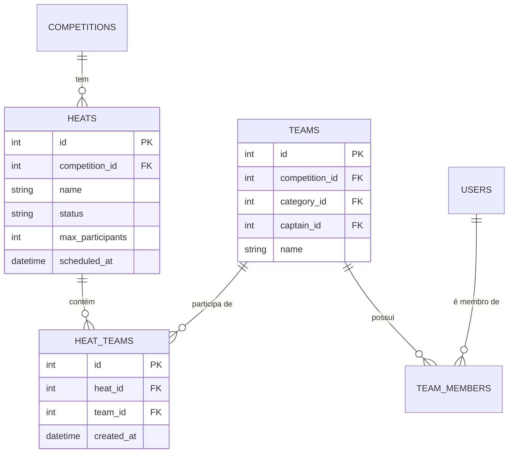

# ADR-003 — Design: Tabela de junção HeatTeam para associação bateria-equipe

**Data:** 2026-03-10
**Status:** Aceito
**Contexto:** Implementação dos RF-57 a RF-65 — gerenciamento de baterias (heats) com associação de equipes e validação de capacidade.

---

## Contexto

Uma bateria (heat) pode conter múltiplas equipes, e uma equipe pode ser associada a baterias distintas (embora nunca duas vezes à mesma bateria — RN-13). Isso configura um relacionamento **muitos-para-muitos** entre `heats` e `teams`.

Além de representar a associação, o sistema precisa:
- Validar capacidade total de pessoas na bateria (`max_participants`)
- Calcular `team_count` para as respostas de API
- Permitir remoção individual de equipes

## Decisão

Criar a tabela de junção explícita `heat_teams` com modelo ORM próprio (`HeatTeam`), ao invés de usar a associação implícita do SQLAlchemy (`secondary`).

```python
# backend/app/models/heat.py

class HeatTeam(Base):
    __tablename__ = "heat_teams"
    __table_args__ = (UniqueConstraint("heat_id", "team_id", name="uq_heat_team"),)

    id: Mapped[int] = mapped_column(primary_key=True, index=True)
    heat_id: Mapped[int] = mapped_column(ForeignKey("heats.id", ondelete="CASCADE"), ...)
    team_id: Mapped[int] = mapped_column(ForeignKey("teams.id", ondelete="CASCADE"), ...)
    created_at: Mapped[datetime] = mapped_column(server_default=func.now())

    heat: Mapped["Heat"] = relationship("Heat", back_populates="heat_teams")
    team: Mapped["Team"] = relationship("Team")

class Heat(Base):
    ...
    heat_teams: Mapped[list["HeatTeam"]] = relationship(
        "HeatTeam", back_populates="heat", cascade="all, delete-orphan"
    )
```

### Validação de capacidade (RN-12)

A soma de membros das equipes vinculadas não pode exceder `max_participants`. O cálculo usa `len(team.members)` — atributo ORM carregado via `selectinload` — nunca `team.member_count` (campo computado do schema Pydantic de resposta).

```python
# backend/app/services/heat.py

current_count = sum(len(ht.team.members) for ht in heat.heat_teams)
team_size = max(len(team.members), 1)  # mínimo 1 para equipes sem membros ainda
if current_count + team_size > heat.max_participants:
    raise HTTPException(422, detail=f"Capacidade excedida: ...")
```

### Carregamento eager (selectinload)

Para que `len(ht.team.members)` funcione em sessão assíncrona sem lazy load, a query de `get_by_id` usa cadeia de `selectinload`:

```python
selectinload(Heat.heat_teams)
    .selectinload(HeatTeam.team)
    .selectinload(Team.members)
```

**Atenção:** Os atributos nos `selectinload` devem ser referências às classes ORM (`HeatTeam.team`, `Team.members`), nunca strings. Strings causam `ArgumentError` no SQLAlchemy.

## Alternativas Consideradas

| Alternativa | Motivo da rejeição |
|-------------|-------------------|
| `secondary` implícito do SQLAlchemy (`relationship(..., secondary="heat_teams")`) | Não permite modelo ORM explícito; dificulta adição futura de campos à tabela de junção (ex: `assigned_at`, `notes`) |
| FK direta `team_id` em `heats` (1:N) | Equipes não poderiam mudar de bateria e cada heat suportaria apenas uma equipe |
| FK direta `heat_id` em `teams` | Equipes só poderiam estar em uma bateria; contradiz o modelo de campeonatos com múltiplas baterias |

## Consequências

- **Positivo:** Constraint `UNIQUE(heat_id, team_id)` no banco garante RN-13 sem validação extra no código.
- **Positivo:** `CASCADE DELETE` em `heat_id` remove automaticamente os vínculos ao excluir uma bateria.
- **Positivo:** Modelo extensível — novos campos na junção (ex: `check_in_at`) podem ser adicionados sem reestruturar.
- **Atenção:** O `selectinload` de três níveis (`heat_teams → team → members`) emite queries adicionais. Para baterias com muitas equipes, avaliar `joinedload` se performance for necessária.

## Diagrama de Entidades


