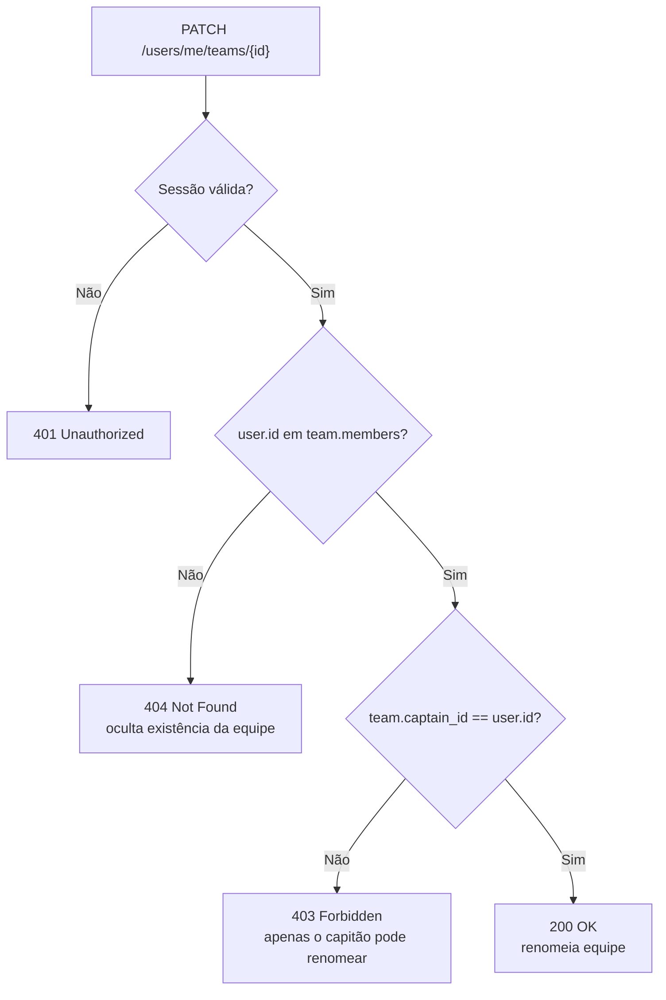

# ADR-004 — Design: Auto-gerenciamento de equipe pelo competidor

**Data:** 2026-03-10
**Status:** Aceito
**Contexto:** Implementação dos RF-66, RF-67, RF-68 — competidor pode visualizar suas equipes e o capitão pode renomear a própria equipe.

---

## Contexto

O sistema precisa permitir que competidores gerenciem aspectos limitados de suas equipes sem acesso de operador. Os requisitos são:
- **RF-67:** Competidor visualiza suas equipes no dashboard
- **RF-68:** Capitão pode renomear a própria equipe

A regra de negócio **RN-16** estabelece que apenas o capitão pode renomear a equipe. Operadores e admins continuam com acesso irrestrito via endpoints existentes.

## Decisão

Adicionar dois endpoints sob o prefixo `/users/me/` para operações do competidor sobre suas próprias equipes:

```
GET  /users/me/teams          → lista equipes onde o usuário é membro
PATCH /users/me/teams/{id}   → renomeia equipe (apenas o capitão)
```

### Autorização em camadas

O endpoint `PATCH /users/me/teams/{id}` verifica:
1. Autenticação (qualquer role via `get_current_user`)
2. Membro da equipe: `user.id in {m.user_id for m in team.members}` → HTTP 404 se não for membro
3. Capitão: `team.captain_id == current_user.id` → HTTP 403 se for membro mas não capitão

```python
# backend/app/api/v1/users.py

@router.patch("/me/teams/{team_id}")
async def update_my_team(
    team_id: int,
    body: UpdateTeamNameRequest,
    current_user: User = Depends(get_current_user),
    db: AsyncSession = Depends(get_db),
):
    team = await TeamRepository.get_by_id(db, team_id)
    member_ids = {m.user_id for m in team.members}
    if current_user.id not in member_ids:
        raise HTTPException(404, "Equipe não encontrada")
    if team.captain_id != current_user.id:
        raise HTTPException(403, "Apenas o capitão pode renomear a equipe")
    team.name = body.name
    return await TeamRepository.save(db, team)
```

### Consulta de equipes do competidor

```python
# GET /users/me/teams
# Busca times onde o user é TeamMember
result = await db.execute(
    select(Team)
    .join(TeamMember, Team.id == TeamMember.team_id)
    .options(selectinload(Team.members))
    .where(TeamMember.user_id == current_user.id)
)
```

## Alternativas Consideradas

| Alternativa | Motivo da rejeição |
|-------------|-------------------|
| Reutilizar `PATCH /competitions/{id}/teams/{id}` com verificação de role | Mistura permissões de operador com auto-gerenciamento; semanticamente diferente (operador gerencia qualquer equipe, competidor gerencia a sua) |
| Endpoint genérico `PATCH /teams/{id}` com verificação de capitão | Sem o prefixo `/me/`, a semântica de "meu recurso" fica implícita; mais difícil de auditar e documentar |
| Frontend faz rename direto (sem backend) | Inviável — o banco é a fonte de verdade; LGPD e integridade de dados exigem persistência no servidor |

## Consequências

- **Positivo:** Competidores têm autonomia limitada sem necessitar de operador para rename simples.
- **Positivo:** Separação clara entre endpoints de gerenciamento (`/competitions/.../teams`) e auto-serviço (`/users/me/teams`).
- **Positivo:** Verificação de ownership em duas camadas (membro → capitão) previne escalada de privilégio entre membros da mesma equipe.
- **Atenção:** O 404 retornado para não-membros (ao invés de 403) é intencional — evita enumeração de equipes por usuários não autorizados.

## Diagrama de Fluxo de Autorização


