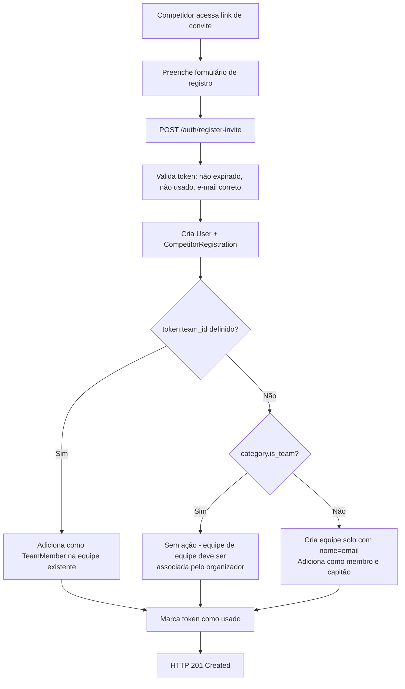

# ADR-005 — Design: Convite com equipe e criação automática de equipe solo

**Data:** 2026-03-10
**Status:** Aceito
**Contexto:** Implementação dos RF-65, RN-14, RN-15 — link de convite pode incluir equipe de destino; categoria individual sem equipe cria time solo automaticamente.

---

## Contexto

O fluxo de registro via convite (RF-06, RF-13) precisava ser estendido para suportar:
- Operador envia convite incluindo `team_id` → ao registrar, o competidor é automaticamente adicionado como membro da equipe
- Para categorias individuais sem `team_id` no convite → uma equipe solo é criada automaticamente com o e-mail do atleta como nome (RN-15)

A distinção entre categorias de equipe e individuais baseia-se no campo `Category.is_team`.

## Decisão

### Estrutura do token de convite

Adicionar `team_id` opcional ao modelo `InviteToken`:

```python
# backend/app/models/token.py
team_id: Mapped[int | None] = mapped_column(
    ForeignKey("teams.id", ondelete="SET NULL"), nullable=True
)
```

`ondelete="SET NULL"` garante que a exclusão de uma equipe não invalide convites pendentes — o registro ocorre sem associação de equipe nesse caso.

### Lógica de associação pós-registro

```python
# backend/app/services/auth_tokens.py

@staticmethod
async def _handle_team_assignment(db, user, token, registration):
    if token.team_id:
        # Adiciona à equipe explicitada no convite (RN-14)
        team = await TeamRepository.get_by_id(db, token.team_id)
        if team:
            db.add(TeamMember(team_id=team.id, user_id=user.id))
    elif token.category_id:
        category = await CategoryRepository.get_by_id(db, token.category_id)
        if category and not category.is_team:
            # Categoria individual sem equipe → cria equipe solo (RN-15)
            solo_team = Team(
                competition_id=token.competition_id,
                category_id=token.category_id,
                captain_id=user.id,
                name=user.email,
            )
            db.add(solo_team)
            await db.flush()
            db.add(TeamMember(team_id=solo_team.id, user_id=user.id))
```

### Envio do convite

```
POST /auth/invite
{
  "email": "atleta@example.com",
  "competition_id": 1,
  "category_id": 2,
  "team_id": 5        ← opcional
}
```

## Alternativas Consideradas

| Alternativa | Motivo da rejeição |
|-------------|-------------------|
| Competidor escolhe equipe na tela de registro (sem `team_id` no token) | Não garante que o competidor entre na equipe correta; organizador perde controle da alocação |
| `team_id` obrigatório no convite | Impossibilita convidar atletas antes de criar as equipes; não suporta categorias individuais |
| Equipe solo com nome do competidor (não do e-mail) | Nome pode não estar disponível no momento do registro (preenchido depois); e-mail é único e sempre disponível |

## Consequências

- **Positivo:** Organizadores têm controle total sobre alocação de equipes via convite.
- **Positivo:** Categoria individual cria estrutura de equipe consistente, simplificando o ranking (todos têm equipe).
- **Positivo:** `ondelete="SET NULL"` previne erro em cascata se a equipe for excluída antes do registro.
- **Atenção:** Equipes solo criadas automaticamente têm o e-mail como nome — operadores devem comunicar que o competidor pode renomear via dashboard (RF-68).
- **Atenção:** Se `token.team_id` aponta para equipe de outra competição, a associação é silenciosamente ignorada (a equipe não é encontrada via `get_by_id`). Validação de `competition_id` no momento da criação do convite deve ser reforçada futuramente.

## Diagrama de Fluxo de Registro


