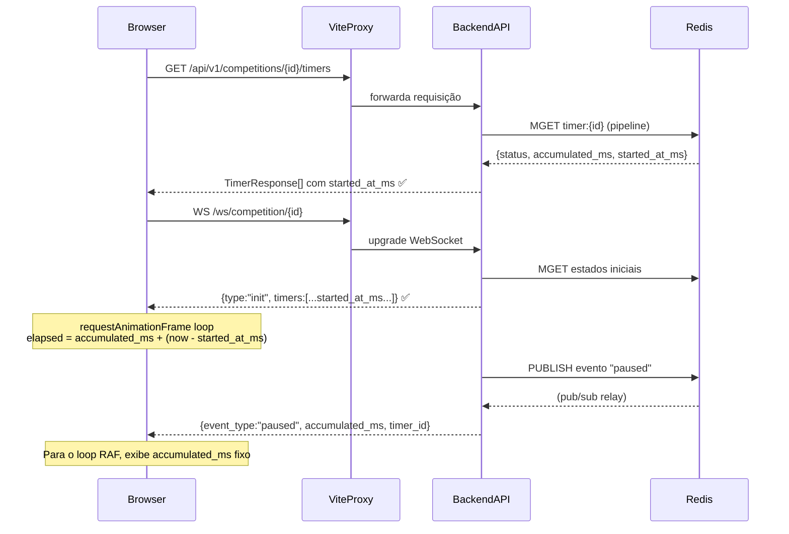

# ADR-006 — Inclusão de `started_at_ms` na `TimerResponse`

**Data:** 2026-03-12
**Status:** Aceito
**Autores:** Vitor Alves

---

## Contexto

O contador ao vivo de timers no frontend (`TeamTimerCard`) usa `requestAnimationFrame`
para atualizar o display a cada segundo enquanto o timer está `running`. Para isso, precisa
saber o instante exato (epoch ms) em que o segmento atual de execução começou:

```
elapsed_live = accumulated_ms + (Date.now() - started_at_ms)
```

Sem `started_at_ms`, o frontend exibe o valor de `accumulated_ms` congelado no momento da
carga da página — o contador não ticia, dando a impressão de que o timer está parado.

## Problema

`TimerResponse` (schema Pydantic) **não incluía o campo `started_at_ms`**. Como consequência:

1. A chamada REST inicial (`GET /competitions/{id}/timers`) retornava `started_at_ms: null`
   para todos os timers, inclusive os que estavam `running`.
2. A mensagem `init` do WebSocket (que usa `TimerResponse.model_dump()`) também omitia o campo.
3. Apenas os **eventos WebSocket em tempo real** (`started`, `resumed`) incluíam `started_at_ms`
   — portanto o contador só funcionava se o timer fosse iniciado *após* o carregamento da página,
   nunca ao recarregar com um timer já em execução.

## Decisão

Adicionar `started_at_ms: int | None = None` à `TimerResponse` e populá-lo em `from_orm()`
quando o estado Redis estiver disponível e o timer estiver `running`:

```python
if redis_state and t.status == TimerStatus.running:
    accumulated_ms = _compute_accumulated_ms_from_redis(redis_state)
    started_at_ms = redis_state.get("started_at_ms")   # ← novo
else:
    accumulated_ms = _compute_accumulated_ms(t)
    started_at_ms = None
```

O valor `started_at_ms` já existia no Redis (gravado por `TimerService.start` e `resume`)
— apenas não estava sendo exposto na resposta da API.

## Consequências

### Positivas

- **Contador ao vivo funciona desde o primeiro render**, mesmo após reload da página.
- **WebSocket `init` message passa a incluir `started_at_ms`**, eliminando a inconsistência
  entre carga inicial e eventos em tempo real.
- Sem alteração de schema no banco de dados (dado vem do Redis).
- Sem breaking change na API — campo é aditivo com `default=None`.

### Considerações

- `started_at_ms` é `null` para timers que não estão `running` (created, ready, paused, finished,
  cancelled). O frontend já trata `started_at_ms == null` como "não está rodando".
- Se o Redis não tiver o estado (ex: restart do Redis), `started_at_ms` será `null` para timers
  running. O frontend mostrará o `accumulated_ms` congelado — comportamento degradado aceitável
  (equivalente ao comportamento anterior ao fix).

## Diagrama — Fluxo de dados do contador ao vivo


