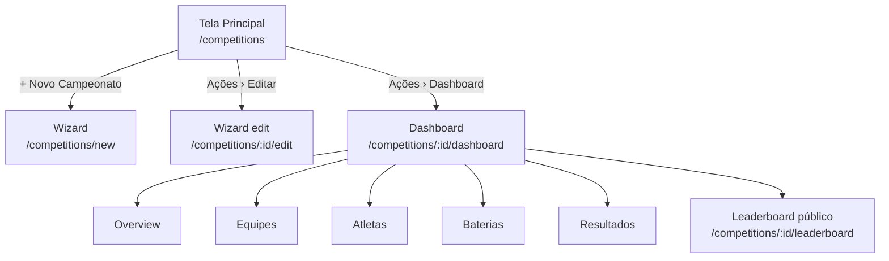

# Spec: Redesenho Completo do Tempus
**Data:** 2026-06-15
**Status:** Aprovado
**Autor:** Vitor + Claude

---

## 1. Visão Geral

Redesenho completo da plataforma Tempus inspirado em ferramentas de mercado como o Champy. O objetivo é transformar a interface atual (tudo inline em uma página) em uma plataforma com fluxos claros de criação via wizard, dashboard dedicado por campeonato e suporte nativo a CrossFit (WODs) e Hyrox (tempo).

### Decisões aprovadas em brainstorming
| Decisão | Escolha |
|---|---|
| Wizard de criação | Página dedicada (full page, não modal) |
| Sidebar do dashboard | Escura fixa (estilo Linear/Notion) |
| Storage de PDFs | Filesystem local |
| CEP lookup | ViaCEP (gratuito, sem chave) |
| Atletas | Registros independentes — sem conta de sistema obrigatória |

---

## 2. Arquitetura Geral

### Fluxo principal



### Camadas que mudam

```
Frontend (React)
├── CompetitionsListPage       ← reescreve CompetitionsPage (simplificado)
├── CompetitionWizardPage      ← novo (5 etapas, página dedicada)
├── CompetitionDashboardLayout ← novo (sidebar escura + nested routes)
│   ├── DashboardOverviewPage
│   ├── TeamsPage (dashboard)
│   ├── AthletesPage           ← novo
│   ├── HeatsPage (dashboard)
│   └── ResultsPage            ← novo
└── LeaderboardPage            ← novo (público, sem login)

Backend (FastAPI)
├── models/competition.py      ← novos campos
├── models/category.py         ← novos campos
├── models/athlete.py          ← novo modelo
├── models/wod.py              ← novo modelo
├── models/wod_category.py     ← novo modelo (junction)
├── api/v1/competitions.py     ← novos endpoints
├── api/v1/athletes.py         ← novo router
├── api/v1/wods.py             ← novo router
└── api/v1/files.py            ← novo (upload PDF)
```

---

## 3. Backend — Mudanças de Modelo

### 3.1 Competition (alterações)

```python
class EventType(str, enum.Enum):
    hyrox = "hyrox"
    crossfit = "crossfit"

class ScoringModel(str, enum.Enum):
    lowest_time = "lowest_time"   # Hyrox
    most_points = "most_points"   # CrossFit

class TiebreakCriterion(str, enum.Enum):
    last_checkpoint = "last_checkpoint"
    registration_date = "registration_date"
    alphabetical = "alphabetical"

class OrganizerType(str, enum.Enum):
    person = "person"
    company = "company"
```

**Campos novos / renomeados:**

| Campo | Tipo | Observação |
|---|---|---|
| `start_date` | Date | renomeia `event_date` (migration com alias) |
| `end_date` | Date nullable | novo |
| `event_type` | Enum EventType | novo (hyrox \| crossfit) |
| `description` | Text nullable | novo |
| `is_public` | Boolean default False | novo |
| `regulation_pdf_path` | String(500) nullable | novo |
| `requirements_pdf_path` | String(500) nullable | novo |
| `tshirts_enabled` | Boolean default False | novo |
| `organizer_type` | Enum OrganizerType nullable | novo |
| `organizer_name` | String(200) nullable | novo |
| `organizer_email` | String(200) nullable | novo |
| `organizer_phone` | String(30) nullable | novo |
| `organizer_document` | String(20) nullable | CPF ou CNPJ |
| `scoring_model` | Enum ScoringModel nullable | novo |
| `tiebreak_criterion` | Enum TiebreakCriterion nullable | novo |

**Campos removidos:** `modality_id`, `duration_seconds`, `max_athletes`, `rules`
> Esses campos perdem sentido com a nova estrutura. `rules` é substituído por `regulation_pdf_path`. `duration_seconds` passa a viver no WOD/Category level.

### 3.2 Category (alterações)

```python
class Gender(str, enum.Enum):
    male = "male"
    female = "female"
    mixed = "mixed"
```

**Campos novos:**

| Campo | Tipo | Observação |
|---|---|---|
| `gender` | Enum Gender nullable | Feminino / Masculino / Misto |
| `age_restriction_enabled` | Boolean default False | novo |
| `age_min` | Integer nullable | novo |
| `age_max` | Integer nullable | novo (None = sem limite superior) |

### 3.3 Athlete (novo modelo)

```python
class TshirtSize(str, enum.Enum):
    P = "P"; M = "M"; G = "G"; GG = "GG"; XG = "XG"

class Athlete(Base):
    __tablename__ = "athletes"

    id: Mapped[int] = mapped_column(primary_key=True, index=True)
    competition_id: Mapped[int] = mapped_column(ForeignKey("competitions.id", ondelete="CASCADE"))
    category_id: Mapped[int | None] = mapped_column(ForeignKey("categories.id", ondelete="SET NULL"), nullable=True)
    team_id: Mapped[int | None] = mapped_column(ForeignKey("teams.id", ondelete="SET NULL"), nullable=True)
    name: Mapped[str] = mapped_column(String(200), nullable=False)
    email: Mapped[str | None] = mapped_column(String(200), nullable=True)
    document: Mapped[str | None] = mapped_column(String(20), nullable=True)   # CPF
    phone: Mapped[str | None] = mapped_column(String(30), nullable=True)
    tshirt_size: Mapped[TshirtSize | None] = mapped_column(Enum(TshirtSize), nullable=True)
    created_at: Mapped[datetime] = mapped_column(server_default=func.now())
    updated_at: Mapped[datetime] = mapped_column(server_default=func.now(), onupdate=func.now())
```

**CSV esperado para importação:**
```
nome,email,documento,telefone,equipe,categoria,tamanho_camiseta
Carlos Mendes,carlos@email.com,123.456.789-00,(11)99999-0000,Team Alpha,Elite Masculino,M
```

### 3.4 WOD (novo modelo — somente CrossFit)

```python
class ResultType(str, enum.Enum):
    time = "time"
    time_reps = "time_reps"
    time_ms = "time_ms"
    reps = "reps"
    distance = "distance"
    calories = "calories"

class WodPublication(str, enum.Enum):
    immediate = "immediate"
    scheduled = "scheduled"
    unpublished = "unpublished"

class WOD(Base):
    __tablename__ = "wods"

    id: Mapped[int] = mapped_column(primary_key=True, index=True)
    competition_id: Mapped[int] = mapped_column(ForeignKey("competitions.id", ondelete="CASCADE"))
    title: Mapped[str] = mapped_column(String(200), nullable=False)
    result_type: Mapped[ResultType] = mapped_column(Enum(ResultType), nullable=False)
    wod_date: Mapped[date | None] = mapped_column(Date, nullable=True)
    tiebreak_enabled: Mapped[bool] = mapped_column(Boolean, default=False)
    publication: Mapped[WodPublication] = mapped_column(Enum(WodPublication), default=WodPublication.unpublished)
    scheduled_at: Mapped[datetime | None] = mapped_column(nullable=True)
    description: Mapped[str | None] = mapped_column(Text, nullable=True)
    sort_order: Mapped[int] = mapped_column(Integer, default=0)
    created_at: Mapped[datetime] = mapped_column(server_default=func.now())
    updated_at: Mapped[datetime] = mapped_column(server_default=func.now(), onupdate=func.now())
```

### 3.5 WODCategory (junction — configuração por categoria dentro de um WOD)

```python
class WODCategory(Base):
    __tablename__ = "wod_categories"

    id: Mapped[int] = mapped_column(primary_key=True, index=True)
    wod_id: Mapped[int] = mapped_column(ForeignKey("wods.id", ondelete="CASCADE"))
    category_id: Mapped[int] = mapped_column(ForeignKey("categories.id", ondelete="CASCADE"))
    time_cap_seconds: Mapped[int | None] = mapped_column(Integer, nullable=True)
    target_value: Mapped[int | None] = mapped_column(Integer, nullable=True)  # reps/metros/cals
    __table_args__ = (UniqueConstraint("wod_id", "category_id"),)
```

---

## 4. Backend — Novos Endpoints

### 4.1 Athletes

```
GET    /api/v1/competitions/{id}/athletes          Lista com filtros (category_id, team_id)
POST   /api/v1/competitions/{id}/athletes          Criar atleta
PUT    /api/v1/competitions/{id}/athletes/{aid}    Editar atleta
DELETE /api/v1/competitions/{id}/athletes/{aid}    Remover atleta
POST   /api/v1/competitions/{id}/athletes/import   CSV bulk import
```

### 4.2 WODs

```
GET    /api/v1/competitions/{id}/wods              Lista de WODs
POST   /api/v1/competitions/{id}/wods              Criar WOD
PUT    /api/v1/competitions/{id}/wods/{wid}        Editar WOD
DELETE /api/v1/competitions/{id}/wods/{wid}        Remover WOD
POST   /api/v1/competitions/{id}/wods/{wid}/categories/{cid}     Associar categoria
DELETE /api/v1/competitions/{id}/wods/{wid}/categories/{cid}     Desassociar categoria
PUT    /api/v1/competitions/{id}/wods/{wid}/categories/{cid}     Configurar time cap / target
```

### 4.3 Files (PDF upload)

```
POST   /api/v1/competitions/{id}/files/regulation     Upload PDF regulamento
POST   /api/v1/competitions/{id}/files/requirements   Upload PDF requisitos
GET    /api/v1/files/{filename}                       Servir arquivo (público)
```

**Storage:** `backend/uploads/competitions/{competition_id}/` com nomes de arquivo sanitizados.

### 4.4 CEP (proxy para ViaCEP)

```
GET    /api/v1/cep/{cep}    Retorna logradouro, bairro, localidade, uf
```

Proxiamos para evitar CORS do frontend chamando ViaCEP diretamente.

### 4.5 Resultados / Leaderboard

```
GET    /api/v1/competitions/{id}/results               Dashboard interno (admin/operator)
GET    /api/v1/competitions/{id}/results/export/pdf    Exporta PDF
GET    /api/v1/competitions/{id}/results/export/csv    Exporta CSV
GET    /api/v1/competitions/{id}/leaderboard           Público (sem auth), por categoria
```

**Motor de pontuação:**
- **Hyrox:** ordena por `final_seconds` ASC dentro de cada categoria. Penalidades já somadas no timer.
- **CrossFit:** calcula pontos por posição em cada WOD concluído. Modelo de pontos:
  - 1º = 100, 2º = 95, 3º = 92, 4º = 89... (decrescente de 3 a partir do 3º)
  - Ausência em WOD = 0 pontos
  - Ranking geral = soma de pontos em todos os WODs

---

## 5. Frontend — Novas Rotas

```
/competitions                          CompetitionsListPage
/competitions/new                      CompetitionWizardPage (mode=create)
/competitions/:id/edit                 CompetitionWizardPage (mode=edit)
/competitions/:id/dashboard            CompetitionDashboardLayout
  /competitions/:id/dashboard          DashboardOverviewPage (index)
  /competitions/:id/dashboard/equipes  TeamsPage
  /competitions/:id/dashboard/atletas  AthletesPage
  /competitions/:id/dashboard/baterias HeatsPage
  /competitions/:id/dashboard/resultados ResultsPage
/competitions/:id/leaderboard          LeaderboardPage (público)
```

---

## 6. Componentes Frontend — Detalhamento

### 6.1 CompetitionsListPage
- Tabela: Nome | Data início → fim | Tipo (badge Hyrox/CrossFit) | Status | Ações
- Botão "+ Novo Campeonato" → navega para `/competitions/new`
- Dropdown por linha: Editar / Dashboard / Remover
- Remover: confirm dialog

### 6.2 CompetitionWizardPage (5 etapas)

**Etapa 1 — Informações Gerais** (3 sub-seções)
- 1.1 Básicas: nome, data início, data fim, CEP (lookup ViaCEP) + endereço auto-preenchido + número/complemento
- 1.2 Tipo do evento: card selector Hyrox / CrossFit
- 1.3 Categorias: tabela com CSV import + form inline (nome, gênero, atletas/equipe min 1, restrição etária)

**Etapa 2 — Divulgação**
- Toggle is_public
- Se público: textarea descrição, upload PDF regulamento, upload PDF requisitos, toggle camisetas
- Organizador: selector PF/PJ → campos (nome, email, telefone, CPF ou CNPJ)

**Etapa 3 — WODs** (exibida apenas se event_type = crossfit)
- Form criar WOD: título, tipo resultado, data, toggle tiebreak, publicação
- Tabela de WODs com expansão inline para configuração por categoria
- Ao expandir: adicionar/remover categorias + configurar time cap e target_value

**Etapa 4 — Pontuação**
- Cards selecionáveis: Menor Tempo (Hyrox) / Mais Pontos (CrossFit) — pré-selecionado conforme event_type
- Radio buttons critério de desempate

**Etapa 5 — Finalização**
- Grid de cards com resumo das etapas anteriores
- Botão "Criar Campeonato" → POST → redireciona para `/competitions/:id/dashboard`
- Em modo edição: botão "Salvar Alterações"

**Comportamento de navegação:**
- Dados de cada etapa salvos em estado local (React state) até a Etapa 5
- Não persiste rascunho no banco (cria tudo na Etapa 5 em uma única requisição)
- Botões Voltar/Avançar validam campos obrigatórios da etapa atual

### 6.3 CompetitionDashboardLayout
- Sidebar escura (`bg-slate-900`) fixa à esquerda, 200px
- Topo da sidebar: nome do campeonato + badge de status
- Itens: Dashboard · Participantes (com sublinks Equipes / Atletas) · Baterias · Resultados · Leaderboard
- Conteúdo principal renderizado via `<Outlet />` (React Router nested routes)

### 6.4 DashboardOverviewPage
- Cards métricas: dias até início / equipes / atletas / categorias
- Painel informações do evento: local, tipo, organizador, status de inscrição

### 6.5 TeamsPage (dashboard)
- Filtro por categoria + busca por nome
- Tabela: Nome | Categoria | Atletas (X/max) | Ações
- CSV import + form inline para nova equipe
- Edição inline por linha

### 6.6 AthletesPage (novo)
- Tabela: Nome | Email | Documento | Equipe | Categoria | Ações
- CSV import + form modal para novo atleta
- Campos: nome*, email, documento (CPF), telefone, equipe, categoria, tamanho camiseta

### 6.7 HeatsPage (dashboard)
- Cards de bateria com timers das equipes em tempo real
- Botões Iniciar / Encerrar bateria
- Adicionar equipe à bateria via select
- Status via WebSocket (reutiliza `useCompetitionSocket`)

### 6.8 ResultsPage (novo)
- Abas por categoria + "Geral"
- Tabela ranking: posição, equipe, tempo/pontos, penalidades, final
- Exportação PDF (WeasyPrint, endpoint backend) e CSV

### 6.9 LeaderboardPage (público)
- Tema escuro (não usa MainLayout)
- Header com nome do campeonato + status ao vivo
- Pills de filtro de categoria
- Tabela: posição, equipe, categoria, tempo/pontuação, status (em curso / finalizado)
- Atualização em tempo real via WebSocket
- Sem necessidade de autenticação

---

## 7. Migrations Alembic

Alinhadas com as fases de implementação:

| Migration | Fase | Descrição |
|---|---|---|
| `20260615_competition_core_fields` | 1 | Renomeia `event_date` → `start_date`; adiciona `end_date`, `event_type`, `is_public`, `scoring_model`, `tiebreak_criterion`; remove `modality_id`, `duration_seconds`, `max_athletes`, `rules` |
| `20260615_category_gender_age` | 1 | Adiciona `gender`, `age_restriction_enabled`, `age_min`, `age_max` em categories |
| `20260615_athletes_table` | 1 | Cria tabela `athletes` |
| `20260615_competition_divulgacao_fields` | 2 | Adiciona `description`, `regulation_pdf_path`, `requirements_pdf_path`, `tshirts_enabled`, `organizer_type`, `organizer_name`, `organizer_email`, `organizer_phone`, `organizer_document` |
| `20260615_wods_table` | 3 | Cria tabelas `wods` e `wod_categories` |

> Todas as migrations usam `batch_alter_table` para compatibilidade com SQLite em desenvolvimento.

---

## 8. Fases de Implementação

### Fase 1 — Core Redesign (fundação)
**Backend:**
- Migration: competition_redesign_fields (sem PDFs/organizer ainda)
- Migration: category_gender_age
- Migration: athletes_table
- Schemas e endpoints Athletes (CRUD + import CSV)
- Atualizar endpoint Competition (novos campos, validações)
- Endpoint CEP proxy

**Frontend:**
- `CompetitionsListPage` (reescreve)
- `CompetitionWizardPage` — Etapas 1, 4, 5 (sem Divulgação e sem WODs)
- `CompetitionDashboardLayout` com sidebar
- `DashboardOverviewPage`
- `TeamsPage` e `AthletesPage` (dentro do dashboard)
- `HeatsPage` (migra da CompetitionsPage atual para o dashboard)

### Fase 2 — Divulgação + PDFs
**Backend:**
- Migration: adiciona campos PDF/organizer/tshirts na competition
- Endpoint upload de PDF (`/api/v1/competitions/{id}/files/*`)
- Servir arquivos estáticos
- Validação de tamanho e tipo de arquivo (PDF, max 10MB)

**Frontend:**
- Wizard Etapa 2 completa (toggle público, drag-and-drop PDF, organizador PF/PJ)
- Campo CEP com lookup ViaCEP na Etapa 1

### Fase 3 — WODs + Pontuação + Leaderboard
**Backend:**
- Migration: wods + wod_categories
- Endpoints WODs e WODCategories
- Motor de pontuação (lowest_time e most_points)
- Endpoints resultados + export PDF (WeasyPrint) + export CSV
- Endpoint leaderboard público

**Frontend:**
- Wizard Etapa 3 (WODs) — exibida só se CrossFit
- `ResultsPage` com abas e exportação
- `LeaderboardPage` pública com tema escuro e WebSocket

---

## 9. Segurança e Permissões

- Endpoints de escrita (POST/PUT/DELETE) em competitions/athletes/wods/heats: `require_roles("operator", "admin")`
- Endpoints de leitura de resultados dentro do dashboard: `require_roles("judge", "operator", "admin")`
- Leaderboard público (`/api/v1/competitions/{id}/leaderboard`): sem autenticação — adicionado em `PUBLIC_PATHS`
- Arquivos PDF servidos publicamente (URL direta, nome randomizado com `secrets.token_hex(8)` para não-adivinhabilidade)
- Upload: validar content-type (application/pdf), tamanho máximo 10MB, sanitizar nome de arquivo

---

## 10. Testes

Cada fase inclui:
- **Testes unitários:** services de pontuação (motor Hyrox e CrossFit)
- **Testes de integração:** endpoints novos (athletes CRUD, wods CRUD, CEP proxy, leaderboard)
- **Testes de import CSV:** cenários happy path + erros de formato
- Cobertura mínima: 80% (meta do projeto)

---

## 11. Fora de Escopo (nesta spec)

- Baterias automáticas (mencionado como "futuramente" pelo usuário)
- Portal de inscrição pública para atletas (a RegistrationPage existente fica inalterada por ora)
- Notificações por email para atletas
- App mobile
